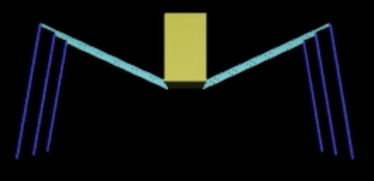

# Model-for-perturbation-analysis
This repository contains the code used in the master's thesis "Expanding a Stance Model to Scale Impulse and Analyze Passive Stability" by Joshua Goldberg. Featured is the model used for perturbation analysis.

### Running the Model

### Necessary Packages

### Associated Work
[1] Goldberg JD. Expanding a Stance Model to Scale Impulse and Analyze Passive Stability, In Proceedings
